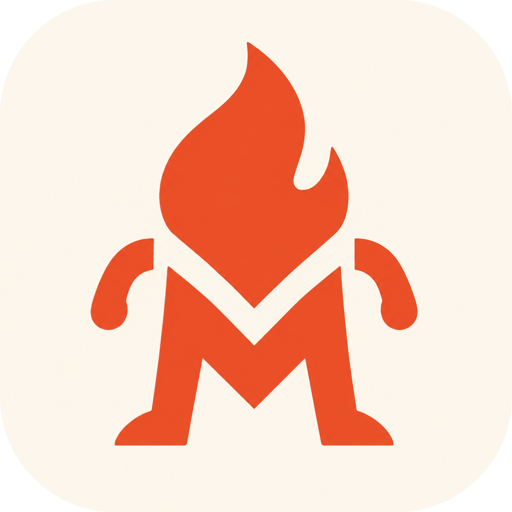

<p align="center">
  
</p>

<h1 align="center">My Man</h1>

<p align="center"><b>The Mac sidekick: meetings, dictation, screenshots, and screen recording — all on-device, all in plain markdown you own.</b></p>

<p align="center">
  <a href="https://muckstack.com/download/myman">Download for Mac</a> ·
  <a href="#building-from-source">Build from source</a> ·
  <a href="CONTRIBUTING.md">Contribute</a>
</p>

---

My Man replaces a stack of subscription tools with one local app: meeting notes (Granola-style), voice dictation (Wispr-Flow-style), screenshots with a full editor (CleanShot-style), and screen recording (Loom-style). There is no backend, no account, and no cloud AI — transcription, OCR, translation, and summarization all run on-device.

Everything you capture lands in **`~/MyManBrain`** as plain markdown in a git repo: meetings with speaker-attributed transcripts, notes, screenshot OCR, recording transcripts, tasks, and the people you meet with. Point Claude (or any LLM) at the folder and it knows your work. Push the repo anywhere for backup. Your data is files, forever.

## Features

- **⌥Space launcher** — command palette + universal search across notes, transcripts, screenshot text, and dictation history (keyword + semantic, ranked by relevance and your click history), flanked by tasks and calendar panels
- **Dictation** — hold Left ⌘, speak, release; text types into any app. On-device speech models, whisper-friendly, AI cleanup, a vocabulary that learns your proper nouns
- **Meetings** — detects Zoom / Meet / Teams / Webex / Slack huddles / Discord / FaceTime; starts listening 45s before calendar meetings but saves nothing without your explicit click; auto-stops on hang-up; named speakers, timestamps, slide snapshots, on-device summaries
- **Screenshots** — region capture, annotation editor (arrows, boxes, highlight, text, pixelate, crop, background removal), Photos-grade text selection, in-place translation
- **Screen recording** — drag any region (persistent frame outline), optional webcam bubble, mic + system audio, local `.mov` files; narration transcribed into the brain
- **Notes** — WYSIWYG markdown, instant capture

## Requirements

macOS 14.2+ (screen recording and translation need macOS 15+). Apple Silicon and Intel.

## Building from source

```bash
git clone https://github.com/tommy-muckstack/myman.git
cd myman
./scripts/run-dev.sh
```

`run-dev.sh` builds with SwiftPM, assembles a minimal `.app` bundle (macOS permission prompts require a real bundle with usage strings), signs it with your Developer ID if one is in your keychain (ad-hoc otherwise — expect repeated permission prompts across rebuilds), and launches it.

Plain `swift build` works for compile checks. Note: [FluidAudio](https://github.com/FluidInference/FluidAudio) is pinned to an exact version on purpose — do not bump it; later versions removed a model this app depends on.

Official releases are signed, notarized, and distributed only by the maintainer — building from source produces an unsigned local copy that cannot receive auto-updates.

## CLI and agent automation

My Man exposes its ordinary user actions through a local URL command surface. This is deliberately UI-equivalent: it still shows selection/permission UI and cannot silently capture anything.

After installing My Man, agents and shell scripts can use:

```bash
open 'myman://screenshot'     # opens the normal region picker
open 'myman://note'
open 'myman://dictation'      # same toggle as the dictation tile
open 'myman://meeting'
open 'myman://cancel-meeting'
open 'myman://record'
```

For a shorter command, an operator can install the bundled helper once:

```bash
mkdir -p ~/.local/bin
ln -sf /Applications/My\ Man.app/Contents/Resources/myman ~/.local/bin/myman
echo 'export PATH="$HOME/.local/bin:$PATH"' >> ~/.zshrc
```

Then call `myman screenshot`, `myman note`, `myman dictation`, `myman meeting`, `myman cancel-meeting`, `myman record`, `myman settings`, or `myman open`. The app must have the normal Screen Recording, Microphone, and Accessibility permissions; this makes capture flows testable while retaining the same on-screen confirmation a person receives.

### Optional private voice replies (Chatterbox beta)

Open the launcher, use the search field, then choose **Chat β**. Text chat is
ephemeral. To hear local voice replies, run `./scripts/install-chatterbox.sh`
once and `./scripts/run-chatterbox.sh` while using Chat. The companion binds
only to `127.0.0.1`; no prompt, transcript, or API key is sent to a service.

## Privacy

All AI runs on-device (speech models, Vision OCR, Apple Translation, Foundation Models). Captures are stored locally. Official builds send anonymous usage analytics and crash reports (counts, kinds, and durations — never your content) and check a static feed for updates. The analytics keys are injected at release-build time and are not in this repo, so builds from source send no telemetry at all.

## Acknowledgments

The meeting-capture architecture (CoreAudio process taps, diarization approach, meeting detection) is informed by the MIT-licensed [Muesli](https://github.com/Muesli-HQ/muesli) project. Built with [FluidAudio](https://github.com/FluidInference/FluidAudio), [GRDB](https://github.com/groue/GRDB.swift), [Sparkle](https://sparkle-project.org), [Amplitude](https://amplitude.com), and [Sentry](https://sentry.io).

## License

[Apache-2.0](LICENSE) © MuckStack, LLC
