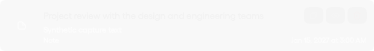
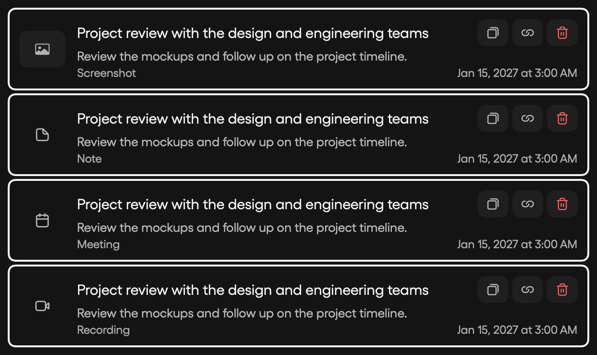
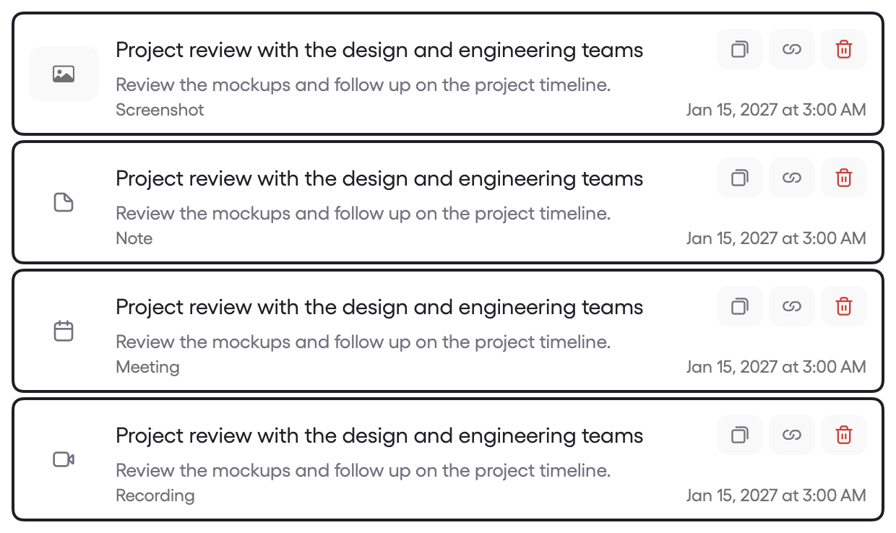

# Capture row actions

Hover a capture in the launcher or a theme timeline to reveal **Copy**, **Copy Path**, and **Delete**. Keyboard-selected rows show the same controls, and VoiceOver exposes named actions. The buttons are separate from the row's Open button, so copying does not open the capture. Delete uses the existing confirmation dialog.

Copy preserves the capture's type: screenshots copy as images, screen recordings as files, and notes, meetings, and dictations as text. Copy Path places the original media path on the clipboard, or the exported MyManBrain Markdown path for text captures. Missing files leave the clipboard unchanged and show feedback.

Verification uses synthetic captures and a private pasteboard for image/file/text copying and path checks. The native mouse fixture uses the same floating panel as the launcher: it moves onto the row, clicks Copy, verifies the clipboard text, and confirms that the Open callback was not invoked. Run it with `MYMAN_VERIFY_CAPTURE_ROW_CLICK=enabled swift test --filter CaptureRowActionTests.testOptInHoverCopyClickDoesNotOpenTheCapture` from a terminal with Accessibility access.

Actual hover in the native fixture:

The following fixtures show the controls for each content type using keyboard focus, in both themes:

