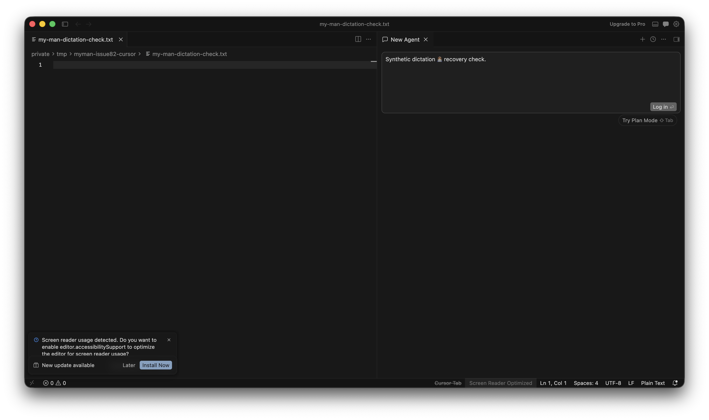
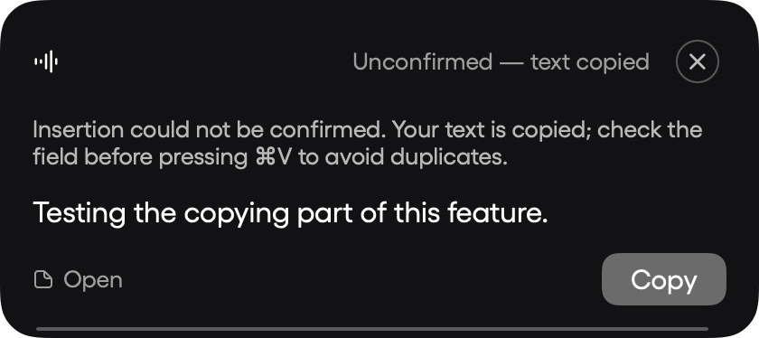

# Cursor dictation delivery — issue #82

The result pill now uses the delivery outcome. Only a changed field whose value matches the expected insertion can say **Pasted**. An unverified or interrupted insertion copies the full dictation, explains that the field needs checking before another paste, and keeps the result visible for 12 seconds. Older recovery history remains readable.

Electron targets use one clipboard Paste command instead of AXSelectedText, which Chromium can acknowledge without updating its document. MyMan checks the foreground application and focused field before sending input and while polling for confirmation; it never retries an uncertain insertion. Cursor's empty contenteditable paragraph reports a placeholder newline that disappears on the first paste, so that exact empty-field case is also accepted on read-back.

## Verification

- Regression fixtures cover ignored AX writes, ignored Paste commands, delayed read-back, unreadable fields, focus changes, interrupted Unicode input, clipboard failure, selection replacement, and unchanged text that must not count as proof of insertion.
- A native integration test inserted synthetic Unicode text into Cursor's chat input without submitting it. Read-back confirmed the exact text, the outcome was `verified`, and the clipboard retained the text. Observed delivery time: 231 ms.
- Rendered result pills were inspected for verified, clipboard-only, and unverified outcomes.

To repeat the native test, open an empty file named `my-man-dictation-check.txt` in a separate Cursor window and focus its empty chat input. Run `MYMAN_VERIFY_CURSOR_DELIVERY=chat swift test --filter DictationDeliveryTests.testOptInCursorDelivery` from a terminal with Accessibility access. The test rejects other windows and nonempty inputs, except for its own exact synthetic phrase when repeating the test. It does not send the chat message. Use `MAN_SCREENSHOT_UI_REVIEW=/tmp/myman-dictation-ui swift test --filter DictationDeliveryTests.testRenderTruthfulResultPills` to render the result cards.

