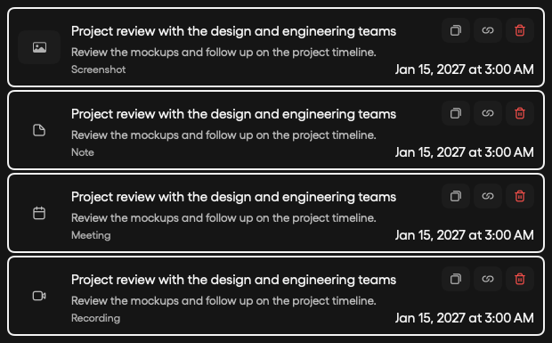
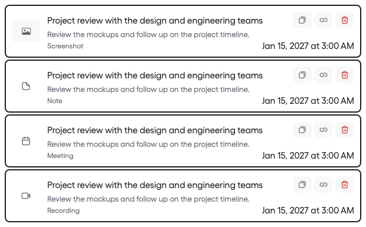

# Launcher dates and panel alignment

Search-result dates use the body font (15pt at the default interface scale, previously 11.5pt) and primary text color. The date stays on one line and takes precedence over the match-reason label when horizontal space is limited.

Tasks and Calendar use the launcher’s screen and top edge. When a larger result list moves the launcher to stay on screen, the companion panels move with it. Window changes remain deferred outside SwiftUI layout passes.

## Verification

- Debug build and capture-row tests: passed (3 executed, 1 optional click test skipped).
- Native date rendering inspected in both themes at the standard 620pt width.
- Isolated debug app with synthetic data: Tasks, Search, and Calendar all reported screen Y=278 when collapsed (search height 69pt), and Y=279 after typing a search (search height 493pt; companion heights 420pt). Each state had identical top positions across all three windows.

