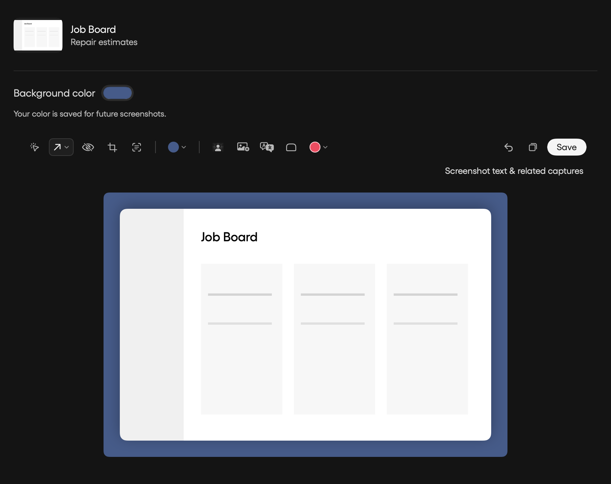

# Recognizable screenshots and saved custom backgrounds

The launcher’s screenshot recents previously hard-coded “Screenshot” and the
first OCR line. They now use the shared capture title, preserve user renames,
show a 72 × 52 thumbnail without cropping, and display app/domain metadata or a
short description. Metadata loads off the main thread and refreshes as OCR and
titles finish. Search and History share the same bounded thumbnail cache.

In the screenshot editor, expand the background swatches and choose the +
swatch for a custom color. The native Mac color picker changes the background;
the chosen RGB color is saved in the Mac user’s preferences and available from
the custom swatch next time. Reopening an edited image does not automatically
add another backdrop. Choosing None also retains the custom color.
Preview and PNG export use the chosen color; export preserves source pixel
density and uses an explicit sRGB rendering context.

Verification covers saved preferences, malformed stored colors, the actual PNG
pixel color and dimensions, descriptive/user titles, and native UI rendering.
The component review below uses a synthetic screenshot, not private captures.

