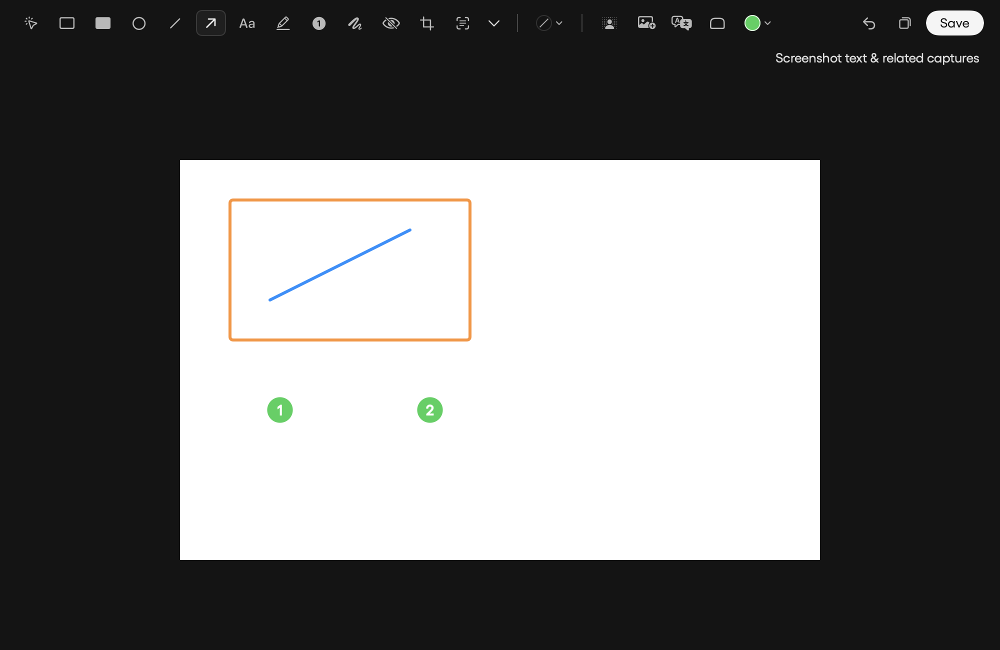

# Independent annotation colors

Each drawing now captures its color when created. Selecting a drawing and choosing a swatch changes that object and the default for future drawings; existing objects retain their colors. The collapsed swatch follows the selection. Highlights retain their transparency. Native preview and saved PNG use the same color lookup, including explicit colors supplied by agent actions.

Regression coverage exercises selected versus unselected color changes, subsequent drawings, moving a recolored object, saved PNG pixels, translucent highlights, numbered badges, and explicit agent colors.

The native SwiftUI editor was rendered with a synthetic fixture and visually inspected:

Reproduce the rendering with `MAN_SCREENSHOT_UI_REVIEW=/tmp/myman-ui-review swift test --filter AnnotationColorTests`.
