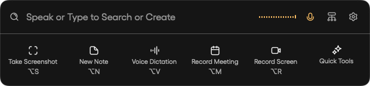
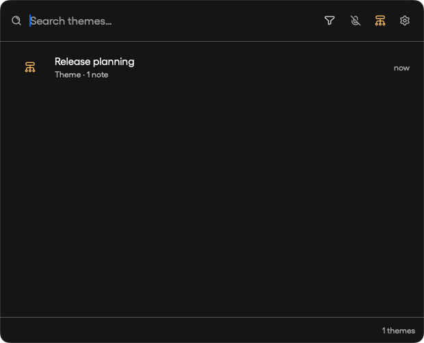
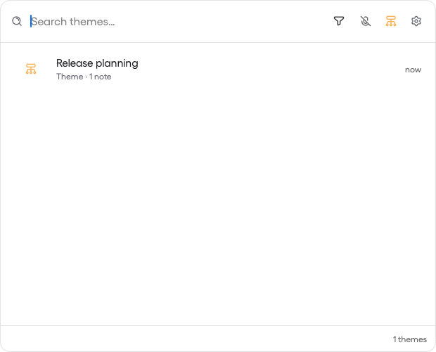
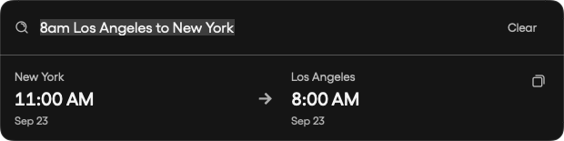
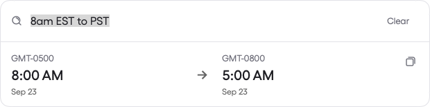

# Launcher themes and time zones — 1.1.98

The Themes icon is immediately left of Settings on the empty launcher. Clicking it opens the existing theme browser inline, stops the current voice session, and highlights the shortcut. Clicking it again or pressing Escape returns to the launcher. Searching within themes and opening theme members use the existing library behavior.

Time zone results always place the larger UTC offset (east) on the left and the smaller offset (west) on the right. Ordering uses the conversion date, including regional daylight saving rules. The requested source time and destination conversion retain their original meaning; each date and label stays paired with its zone.

## Verification

- Existing native converter and visual review: 6 tests passed.
- Existing library and final native visual review: 16 tests passed, including clicking Themes in light and dark mode and confirming capture stops.
- Visual review uses an isolated in-memory database and synthetic themes and notes.
- Companion schemas and version remain unchanged at 0.12.0.

