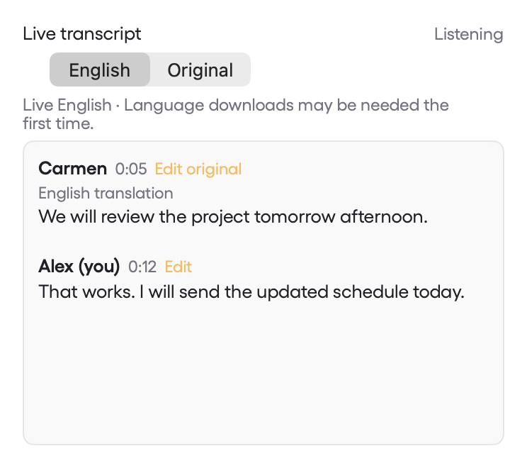
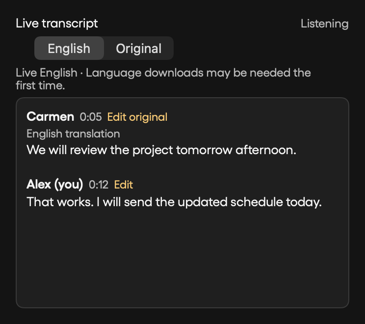

# Live English in the meeting Transcript tab

On macOS 15 or later, the live meeting Transcript tab defaults to **English**. New speech passages are translated into English on-device through Apple's Translation framework. **Original** restores the recognized words immediately. Speaker labels, timestamps, screenshot seeking, scroll position, and editing remain connected to the original transcript.

Translation follows the existing bounded speech-recognition chunks, so it arrives after a passage is recognized, not word by word. The meeting recognizer uses Parakeet v3's 25 European languages; translation additionally requires an Apple-supported source/English pair. This does not add recognition of every language. A first use can require a language-model download. macOS 14 continues to show original speech with an availability message.

The original audio, transcript checkpoints, final saved transcript, and human corrections remain in the source language. English is a live reading view. `Edit original` makes that distinction visible. Recording and recognition continue if translation fails; affected passages are labelled as original, with a Retry control. A failed language is not requested again for every new utterance. Switching away from the tab cancels its translation session; pending work resumes when the tab returns.

## Implementation and checks

- Immutable recognized passages are cached individually, so a long uninterrupted speaker does not cause repeated translation of all earlier speech.
- Batches contain one detected source language, at most four passages of at most 1,200 characters each. Undetected languages are submitted individually.
- Request identities and exact source text prevent delayed responses from replacing edits, a disabled English view, or a different meeting.
- Translation does not change diarization or claim better speaker identification. Zoom/Meet speaker attribution is a separate integration concern.
- Native suite: 533 tests, 40 optional skips, zero failures.
- Real Apple Spanish–English translation reached the live Transcript tab in the opt-in smoke test, preserving the original and timestamp. A second run passed a 5.56-second synthetic Spanish audio clip through the meeting's Parakeet reader and the actual SwiftUI translation worker into English. Both models were already installed. This is synthetic audio verification, not a multilingual conference or overlapping-speaker test.
- Debug/test compilation and universal Intel/Apple silicon release compilation passed.
- Synthetic light/dark layouts were rendered at 372 × 330 points and inspected.

```sh
swift test --filter MeetingLiveTranslationTests
MYMAN_TRANSLATION_SMOKE=1 swift test
MYMAN_TRANSLATION_SMOKE=1 MYMAN_TRANSLATION_AUDIO_FIXTURE=/tmp/spanish-16khz-mono-pcm16.wav swift test --filter MeetingLiveTranslationTests.testInstalledSpanishTranslationReachesLiveTab
MYMAN_TRANSLATION_SCREENSHOTS=/tmp/myman-translation-qa swift test --filter MeetingLiveTranslationTests
swift build -c release --arch arm64 --arch x86_64
```




References: [Apple TranslationSession](https://developer.apple.com/documentation/Translation/TranslationSession), [Parakeet v3 language support](https://huggingface.co/nvidia/parakeet-tdt-0.6b-v3).
