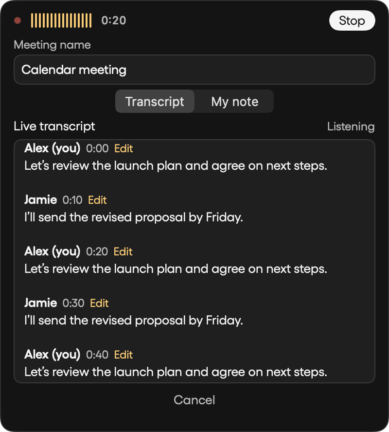
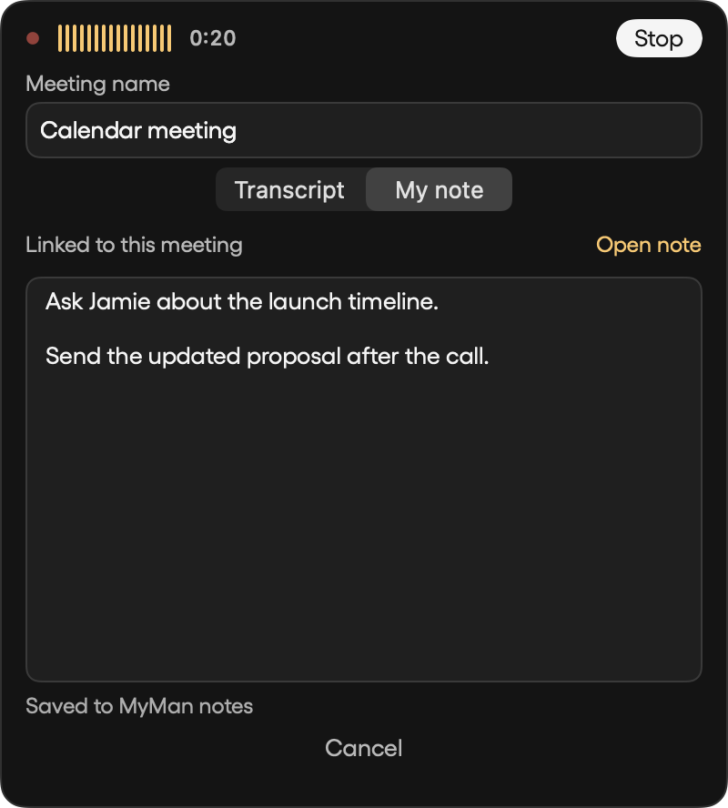

# Meeting recorder release verification — September 15, 2026

Release candidate: My Man 1.1.69 (81), based on 1.1.68.

## Behavior

- Stop frees the recorder immediately. A separate speech engine processes final transcripts in a serial background queue, while the next recording and its live transcript can run.
- Final transcription no longer occupies the recorder widget. Completion shows a four-second toast at the bottom-right.
- Hover reveals rename, Stop, Cancel, a scrollable live transcript with speaker attribution, and an optional linked note. Stop asks for confirmation.
- Human transcript and speaker corrections persist with the meeting. Explicit voice enrollment stays local; conversational cues remain weaker evidence and never enroll a voice automatically.
- The recording dot pulses and respects Reduce Motion. Task and calendar rows use the persistent pointing-hand cursor.
- Calendar refreshes run outside the main thread.

## Verification

- Full Swift suite on the integrated release checkout: 220 tests, 210 passed, 10 optional skips.
- New queue tests hold a transcript in flight while the recorder becomes available, verify serial jobs with identical titles, and preserve the next recording's state on completion.
- Database upgrade tests cover both the released capture-context schema and the early local recording-notes schema, preserving existing notes and voice profiles.
- Native rendering covers compact and expanded recorder layouts, populated transcript and note tabs, keyboard title editing, stable scroll position, and anchored controls at intermediate window heights.
- Tests run with an isolated temporary verification library; fixtures and the screenshots below contain synthetic content.
- The native changes do not alter agent tools, plugin schemas, or bundled marketplace artifacts; no plugin version bump is required.

