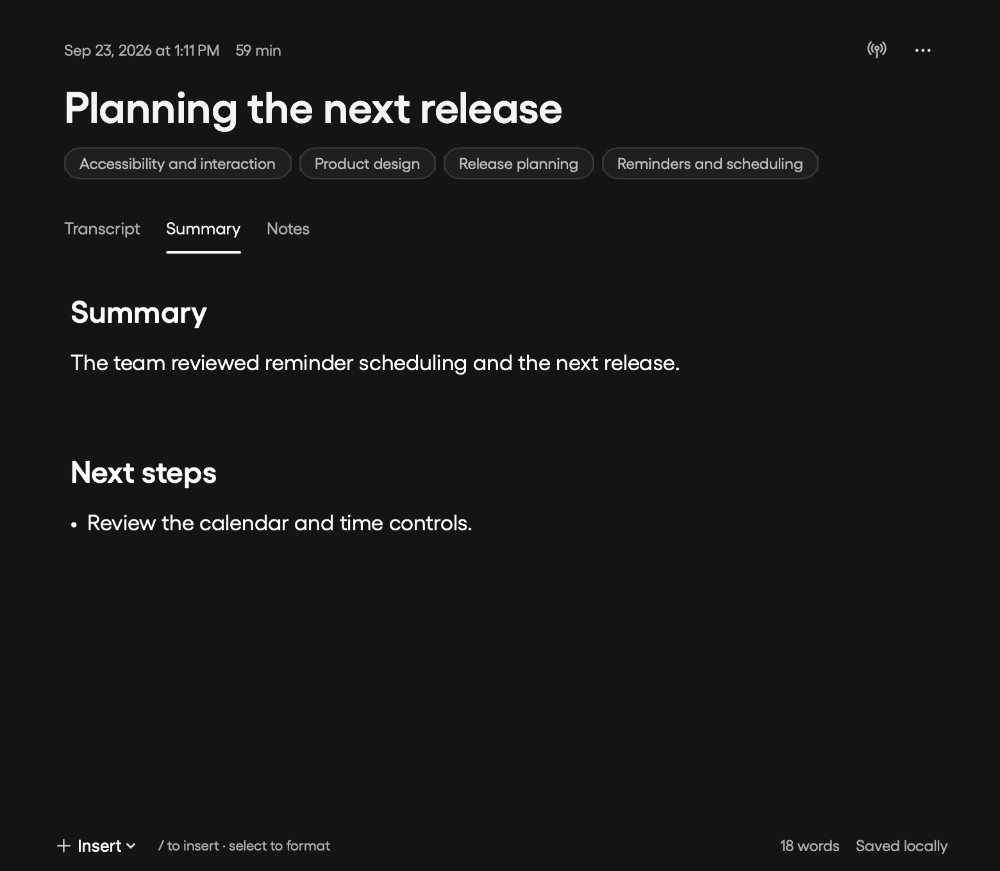
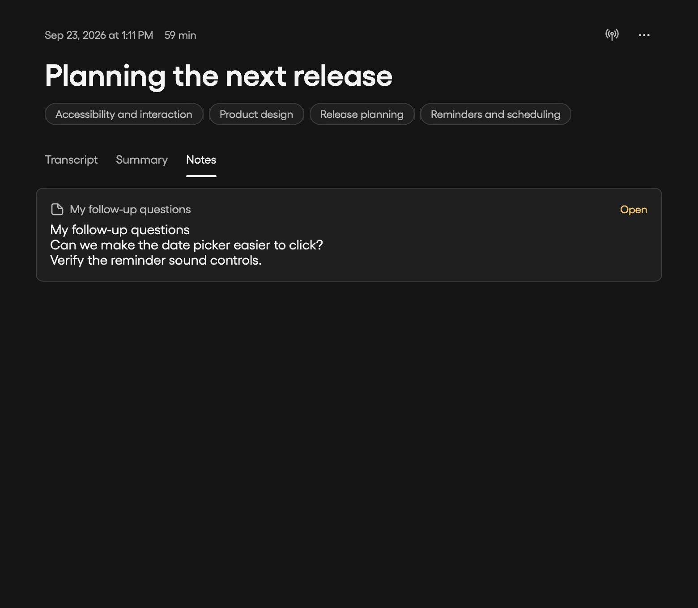
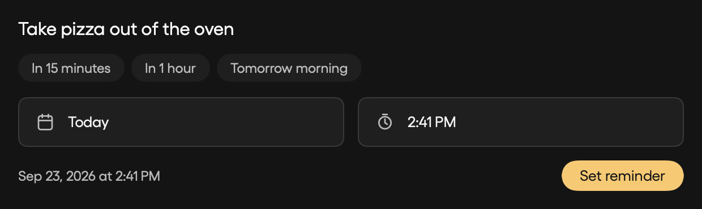
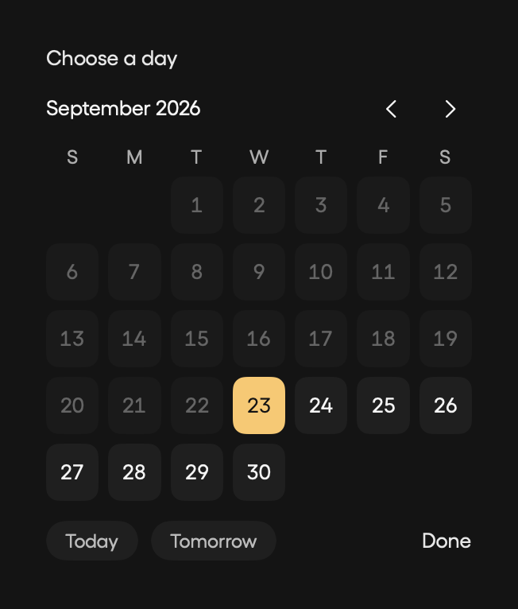
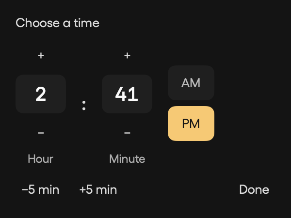
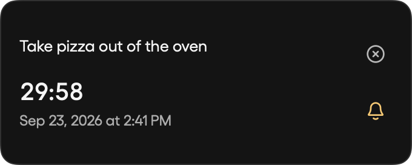
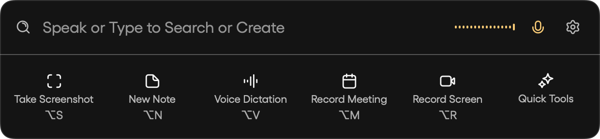

# Meeting, microphone, and reminder review

Synthetic native macOS fixtures for My Man 1.1.97 (109). No private recordings or user content are included.

## Behavior

- Saved meetings use Transcript, Summary, and Notes tabs. Notes shows actual linked My Man notes; assigned themes appear in a horizontally scrolling row beneath the title.
- The launcher remembers microphone on/off across reopening and app restarts. An active legacy one-hour mute migrates to a persistent mute. Typing and voice endpointing stop only the current session. The waveform matches the accent microphone; Browse library is removed.
- Reminders provide large date/time controls, calendar selection, editable hour/minute controls, AM/PM, five-minute adjustments, and common presets. The expanded widget shows the message, countdown, deadline, sound toggle, and dismiss control.
- Local reminder creation finishes before macOS notification authorization; the launcher closes immediately. Dismissing a reminder while authorization is pending cannot bring it back or block another reminder.
- Timer completion uses a retained AVAudioPlayer with a bundled original chime. Playback failure falls back to the system beep. Reminder sound falls back to the app chime when notification sounds are disabled. System output volume/mute still applies.

## Verification

`swift test`: 427 tests, 39 opt-in tests skipped, zero failures.

The final native meeting/reminder/spoken-timer run passed 13 tests with only the audible test skipped (that real-audio test passed separately).

The opt-in real timer check starts a one-second timer, asserts retained audio playback at expiration, and verifies playback finishes. Native UI fixtures cover saved meeting tabs, scheduling controls, and the expanded reminder widget. Automated regressions cover persistent microphone preference, pending authorization, sound toggles, reminder fallback, spoken pizza requests, typed timer submission, Clear, and widget expansion.

The agent action schemas and companion package are unchanged (0.12.0); timer/reminder actions continue using the same models.

## Screenshots

