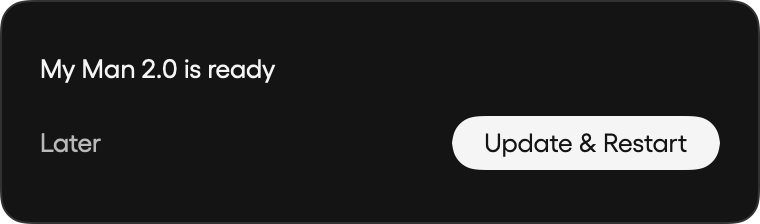

# Idle update prompt

Release builds now default to hourly Sparkle checks. Automatic updates remain subject to the user's existing automatic-check and download preferences. After an automatic download is ready to install, My Man shows a floating “Update & Restart” prompt with a “Later” option that snoozes for one hour. Normal quit installation remains available.

The prompt waits for dictation, meeting startup/recording/transcription/notes, and screen recording startup/capture/transcription to finish. It rechecks immediately on clicking Update & Restart, postpones Sparkle's relaunch if work starts during installation, and has a final AppKit termination guard for the remaining race. A five-second idle monitor hides the prompt during work and resumes an already requested restart when idle.

Regression tests cover busy-to-idle presentation, click-time races, hiding during work, the one-hour snooze, duplicate clicks, delayed relaunch, canceled termination and retry, and aborted updates. Native SwiftUI rendering was visually inspected:

Reproduce the rendering with `MAN_SCREENSHOT_UI_REVIEW=/tmp/myman-ui-review swift test --filter AppUpdateCoordinatorTests`.

The tests inject installer callbacks; they do not replace the installed app or exercise a live signed Sparkle update. Existing versions must receive the release containing this change before they can use this prompt.
